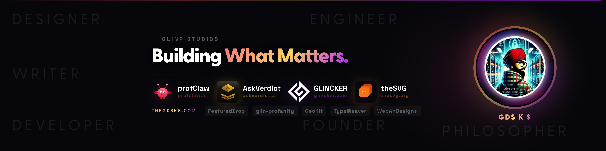

# Gagan Deep Singh

Software architect and open-source creator. I build developer tools and ship products that people actually use.

**[thegdsks.com](https://thegdsks.com)** | [LinkedIn](https://www.linkedin.com/in/gdsks/) | [npm](https://www.npmjs.com/~gdsks)

`1,400+ GitHub stars` | `40K+ monthly npm downloads` | `55+ published packages`

---

### What I'm building

| Project | What it is | |
|---------|-----------|---|
| [**theSVG**](https://thesvg.org) | 5,600+ brand SVG icons. npm, CLI, API, MCP server, VS Code extension. |   |
| [**profClaw**](https://profclaw.ai) | AI agent engine — local-first, runs anywhere. | [profclaw.ai](https://profclaw.ai) |
| [**AskVerdict**](https://askverdict.ai) | AI-powered review analysis platform. | [askverdict.ai](https://askverdict.ai) |
| [**Stacklit**](https://github.com/glincker/stacklit) | One command gives AI agents instant codebase context. Go CLI. |  |
| [**BreathFlow**](https://apps.apple.com/app/id6760687887) | iOS breathing exercises app. |  |
| [**GLINCKER**](https://www.glincker.com) | URL shortening, QR codes, AI content moderation. | [glincker.com](https://www.glincker.com) |

### Open source highlights

| Package | What it does | Downloads/mo |
|---------|-------------|:------------:|
| [glin-profanity](https://www.npmjs.com/package/glin-profanity) | Profanity detection — 24+ languages |  |
| [thesvg](https://www.npmjs.com/package/thesvg) | 5,600+ brand SVG icons |  |
| [@thesvg/react](https://www.npmjs.com/package/@thesvg/react) | Typed React components for brand icons |  |

TypeScript, React, Next.js, Java, Spring Boot, Go, Rust, Swift, Python, PostgreSQL, Redis, Docker, AWS

---

### About me

