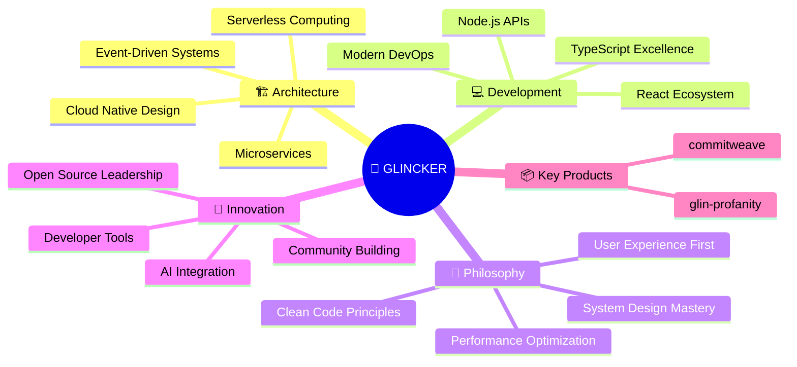

---

## 🎯 Current Focus & Architecture

```mermaid
mindmap
  root((🚀 GLINCKER))
    🏗️ Architecture
      Microservices
      Serverless Computing
      Cloud Native Design
      Event-Driven Systems
    💻 Development
      TypeScript Excellence
      React Ecosystem
      Node.js APIs
      Modern DevOps
    🧠 Philosophy
      Clean Code Principles
      System Design Mastery
      User Experience First
      Performance Optimization
    🌟 Innovation
      Developer Tools
      Open Source Leadership
      Community Building
      AI Integration
    📦 Key Products
      glin-profanity
      commitweave
```

**Minneapolis, US** 📍 • **Travel & Photography** 📸 • **Open Source** 🌟

---

## 📊 GitHub Impact & 1,071 Contributions This Year

  
  

  

  

  

<b>🔥 Featured Projects & Tech Stack</b> (Click to expand)

### 💻 Tech Stack

## 📱 Connect With Me

---

  

