<table width="100%">
<tr>
<td width="33%" align="center">

**🌐 Websites & Projects**

</td>
<td width="33%" align="center">

 

</td>
<td width="33%" align="center">

 

</td>
</tr>
</table>

---

 
**Minneapolis, US** 📍 • **Travel & Photography** 📸 • **Open Source** 🌟

---

## 📊 GitHub Impact & 1,071+ Contributions This Year

  

  

<table width="100%">
<tr>
<td width="50%" >

### 💻 Language Distribution

### 🔥 Quick Stats

 

</td>
<td width="50%" >
 
🏆 GitHub Achievements

</td>
</tr>
</table>
  
 

<b>🔥 Featured Projects & Tech Stack</b> (Click to expand)

<table width="100%">
<tr>
<td width="50%" align="center">

### 🚀 Featured Projects

</td>
<td width="50%" align="center">

### 💻 Tech Stack & Tools

**Languages & Frameworks**

**Cloud & DevOps**

**Databases & Tools**

</td>
</tr>
</table>

 

## 🎯 Current Focus & Architecture

```mermaid
mindmap
  root((🚀 GLINCKER))
    🏗️ Architecture
      Microservices
      Serverless Computing
      Cloud Native Design
      Event-Driven Systems
    💻 Development
      TypeScript Excellence
      React Ecosystem
      Node.js APIs
      Modern DevOps
    🧠 Philosophy
      Clean Code Principles
      System Design Mastery
      User Experience First
      Performance Optimization
    🌟 Innovation
      Developer Tools
      Open Source Leadership
      Community Building
      AI Integration
    📦 Key Products
      glin-profanity
      commitweave
``` 
 

<b>💡 Fun Facts & Personal Info</b> (Click to expand)

<table width="100%">
<tr>
<td width="50%" align="center">

### 🌍 Travel & Photography
**Current Location:** Minneapolis, US 📍 
**Passion:** Capturing moments around the world 📸  
**Philosophy:** Architecture meets wanderlust 🏗️✈️

### 🎯 Current Goals
- 🚀 Growing GLINCKER ecosystem
- 📦 Building developer tools that matter
- 🌟 Contributing to open source community
- 🧠 Exploring AI integration patterns

</td>
<td width="50%" align="center">

### 🎨 Random Quote

### 📚 Learning & Interests
- 🏗️ Software Architecture Patterns
- 🤖 AI/ML Integration in Development
- 📸 Travel Photography & Storytelling
- 🌱 Sustainable Tech Solutions

</td>
</tr>
</table>

---
 